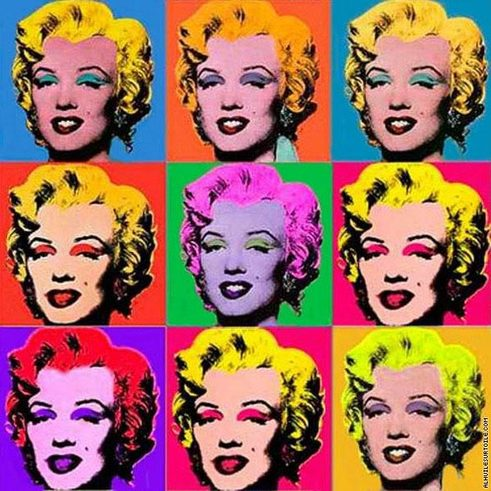

---
COMP310 - Problem Solving Assignment 6
---

## Due: Mon, Apr 8 @ 11:59PM

## Required Background:

- Course Textbook through Chapter 6


## Assignment Overview:

This assignment has one problem, worth a total of 15 points.

1. ***Collage (15 pts):***
   Write a program that creates a collage from six image objects. Each of
   these objects will have at least one operation applied to them.

Additionally:

- Commenting is worth 2 pts.
- You will be required to post your final collage to Piazza. This will be
  worth   1  pt.

The total  for this assignment is therefore 18 points.

Before you start coding, make sure you read through this whole document.
If any of the instructions aren't clear, feel free to ask about it on Piazza
(use the `psa6` folder).


## Initial Setup

Both you and your partner(s) will need to get the starter code for your group
using Git.

1. In VS Code, open the command palette and select the "Git Clone" option.

1. When prompted for the repository URL, enter the following:

      https://github.com/comp110-sp19/PSA6.git

1. Choose the "Open Repository" option in the window that pops up in the
   lower-right corner of the screen.
   

# Computational Problems

## Problem 1: Collage

_Maximum Score: 15 pts (see red text for point breakdown)_

Andy Warhol was a famous American artist, a leader in the movement known as
pop art.
One of his most iconic works was a collage he created of Marilyn Monroe.



For this problem, you will be doing your own take on a collage in the same
style as Warhol.
You will have to do the following:

1. Find an image (pick any non-offensive image that you like).
1. Convert it to GIF if necessary.
2. Scale it to the appropriate size.
3. Create 5 variants of the image, each with at least one process applied to
   it (e.g.  grayscale, negative, or mirroring, etc.).
4. Display them along with the original in a 3x2 pattern in an image window.


When creating your collage, you get to choose which filters you use.
However, there are a few requirements for these filters:

1. One of them must by a **unique** filter to be used with the `pixelMapper`
   function. (Note: the `pixelMapper` function is discussed in the book and is
   part of the starter code).
   By unique, I mean that the filter must not be one that was given in the
   book (e.g. grayscale isn't unique because it is given in the book).
   Furthermore, this unique function must use an `if-else` statement (or
   possibly `if-elif-else`).
2. One of the filters must be a mirror effect, either across the horizontal
   axis (as shown in the kitten example), or across the vertical axis (as we
   discussed in class).
3. One of the filters must use the  blur function.
   
   


### Selecting your Collage Image

Your repository contains a file named `green-bird.gif`, which you can use to test
out the functions you write.
However, you will use another image when it comes time to create your
collage.

You can use whatever file you like, either one created by you (e.g. a picture
you took) or something you find on the internet.
Once you have this image, you will need to convert it into GIF format (a basic
GIF, not an animated one). There are many tools available online, including:

  https://image.online-convert.com/convert-to-gif


Once you have the file in GIF format, copy it into your working folder.


### Function: `shrink`

The first function you should write is one named `shrink`.
This function will take in an image and a factor (an integer) and will return
a new image that is the same as the original, but reduced in size by the given
factor.
For example, `shrink(my_img, 4)` will return a new image which is the same as
`my_img` but whose width and height are both 1/4 the size of the original. 

For this function, you should start with the `double` function given in
Listing 6.9 in your textbook (Section 6.5.2) and modify it to suit your needs.
We talked about the equation to go from the smaller to the larger version in
class so refer to your class notes for guidance on what needs to change in the
`double` function to make it work like `shrink` should.

After you write this function, test it out in the REPL by trying to shrink an
image by several different factors (e.g. 2, 3, and 5).

This function is worth   2  pts.


### Function: `get_shrink_factor`

This function will take in an image as well as a target width and height.
It will return the **minimum** factor by which we should shrink the given
image so that its width does not exceed target width, and its height does not
exceed the target height.
The returned factor **MUST** be an integer value (i.e. don't return 3.7).
If the image is already is within the bounds of the target width and height,
it will return 1.

For example, assume `my_img` refers to an image object with width 1000 and
height 1500.

- `get_shrink_factor(my_img, 500, 500)` should return 3. This is because if
  the `my_img` was shrunk by a factor of 3, it would result in an image of
  width 334 and height 500.
- `get_shrink_factor(my_img, 500, 1000)` should return 2. This is because if
  the `my_img` was shrunk by a factor of 2, it would result in an image of
  width 500 and height 750.
- `get_shrink_factor(my_img, 2000, 2000)` should return 1. This is because the
  image's width and height are already within the target range for width and
  height.

This function is worth   1  pt.


### Function: Unique Pixel Filter

This function (whose name you will decide) will fulfill the "unique" filter
requirement listed above.
This function should take in a pixel and should return a new pixel that is the
same as the old pixel but with some special effect/filter applied.
Examples of this type of filter as the `grayscale` and `negative` function
given in the book (and also in the starter code).

Your unique filter can do anything you want, as long as it is different from
what was done in the book or in class.
It must also use an `if-else` statement to conditionally modify pixels (you
may also include `elif` conditions).

You can test this function in the REPL as shown below, but replace
`unique_filter` with the name of your function, and "foo.gif" with the name of
your 


```python
from collage_creator import *
orig_img = FileImage("green-bird.gif")
filtered_img = pixelMapper(orig_img, unique_filter)
display(orig_img, "Original Image")
display(filtered_img, "Image after applying Unique Filter")
```

This function is worth   2  pts.


### Function: `mirror`

This function will take in an image and return a new image which is the same
as the original but mirrored across either the horizontal or vertical axis.
Recall that mirroring is different than flipping, which your book describes.
Nonetheless, the code for mirroring and flipping should be quite similar, so
make use of the given `verticalFlip` function in the starter code, which was
discussed in section 6.5.3 in our textbook.

As always, test your mirror filter in the REPL to make sure it works
correctly.

This function is worth   2  pts.


### Function: Three Other Filters

You are free to use any other filters for the remaining images of your
collage.
The only restriction is that you must have _at least_ five different filters
used overall, which means you need at least three filters outside of the ones
previously described.
You may use any existing filters from the book/starter code (e.g. grayscale)
or you may come up with your own.
You may use more than six total filters, but that means you would apply more
than one filter to at least one of the images (since you only have 6 shown in
your collage).

These additional filters are worth 2 points each, for a total of   6
 pts.


### Function: `create_collage`

This function will be the one that puts together everything you have done up
to this point.
It should do the following steps.

1. User the `input()` function to ask the user to enter the filename of an
   image (e.g. "cute-cat.gif").
1. Creates a `FileImage` object from the picture that the user specified.
1. Ask the user (again, using `input()`) to enter the maximum **width** of the
   collage.
1. Ask the user (again, using `input()`) to enter the maximum **height** of
   the collage.
1. Use the `get_shrink_factor` function to determine how much each the image
   needs to be shrunk by in order to fit into the requested collage size.
   Remember that your collage will contain an 3x2 grid of the image, so you
   will need to take that into account when calling `get_shrink_factor`.
1. Use the `shrink` function to return a shrunken version of the original
   image.
1. Apply the five filters to the `FileImage` to create five new image objects,
   each with a different filter applied to it.
1. Creates a new `ImageWin`, which will be used to display the collage.
   The title of the window should read "Joe and Jane's Collage", where Joe and
   Jane would be replaced with you and your partners' names.
   The width and height of the window should be the exact size needed to fit
   the collage: this may or may not be the same as the width and height
   entered by the user initially.
1. Use the `setPosition()` method on each of the six image objects
   to set their placement.
   You can look at the `makeGrayScale` function (Listing 6.4 in Section 6.3.2)
   to see how `setPosition()` is used to put an image right next to another
   one.
1. Use the `draw()` method on each of the six image objects to draw
   them on the `ImageWin` object you created.
   Again, the `makeGrayScale` function can help you see how to use the
   `draw()` method.
1. **VERY IMPORTANT:** Call the `exitOnClick()` method on your `ImageWin`
   object to make sure that it doesn't close until you click somewhere on the
   image.
   If you forget this, your image will pop and immediately disappear when you
   run your program.
   See the `display()` function in the starter code to see how this method
   works.

The function is worth   2  pts, broken down as follows:

-   1 pt for correctly getting the filename, desired width, and
  desired height, then resizing the image by the correct scale factor.
-   1 pt for correctly positioning and displaying them six filters
  into a 3x2 grid.


#### Testing Your Collage Creator

You should be able to test your collage creator app by running the
`collage_creator.py` file from your VS code terminal, as follows (replacing
`python3` with `python` if you are using Windows).
Before running the command, make sure you have exited the REPL.

```bash
python3 collage_creator.py
```

This should result in you being prompted to enter the filename, then collage
width, then collage height, before ultimately displaying the collage in
another window.
Note that this image window will likely pop up **behind** your VS Code
application so keep an eye out for it there.

To keep things easier for the grader, your program prompts should look like
the following after running the program (note that the parts after the colons
will be entered by the user).

```
Enter the name of the image file (GIF format): blues.gif
Enter the maximum collage width: 600
Enter the maximum collage height: 400
```

You should test out your program for different images (both `blues.gif` and
your own GIF at a minimum) and for different sizes of collage width/height to
make sure it works as expected.


### Posting your Collage to Piazza

After you have a completed collage, take a screenshot of it and post it to
Piazza under the "PSA6 Show and Tell" post.
Doing so is worth   1  pt.


## Commenting Your Code

You are expected to follow best practices in commenting your code.
This includes:

- Updating the comment at the top of the `collage_creator.py` file with yours
  and your partner's info.
- Including a docstring comment at the beginning of _every_ function you write
  that succinctly describes what it does.
- Add comments to "tricky" spots in your code to explain to yourself, your
  partner, and the grader what the code is doing.
- Using good variable names to make code more readable by others.

Commenting is worth   2  pts so please take it seriously.


## Submission Instructions

**Important**: To be safe, you should run your final code on both you and your
partner’s computers.
This will ensure that you are not relying on any special setup on your own
computer for the code to work.


