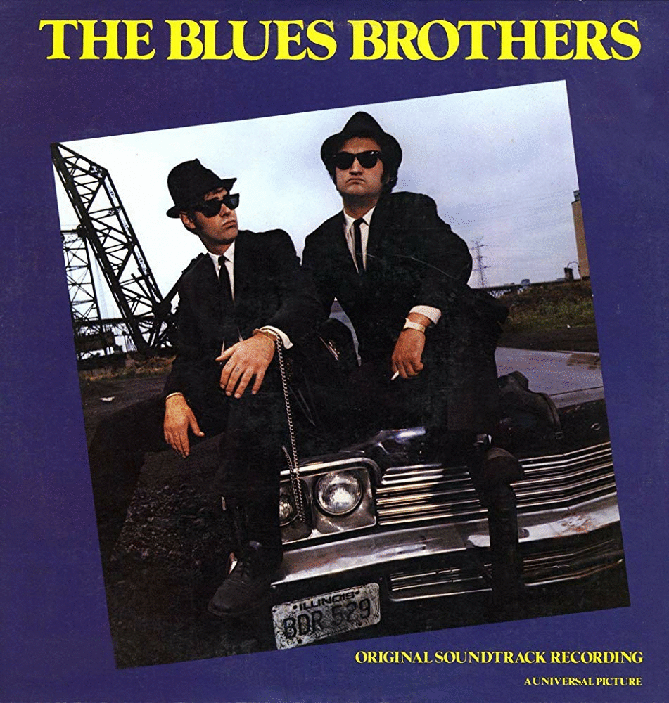
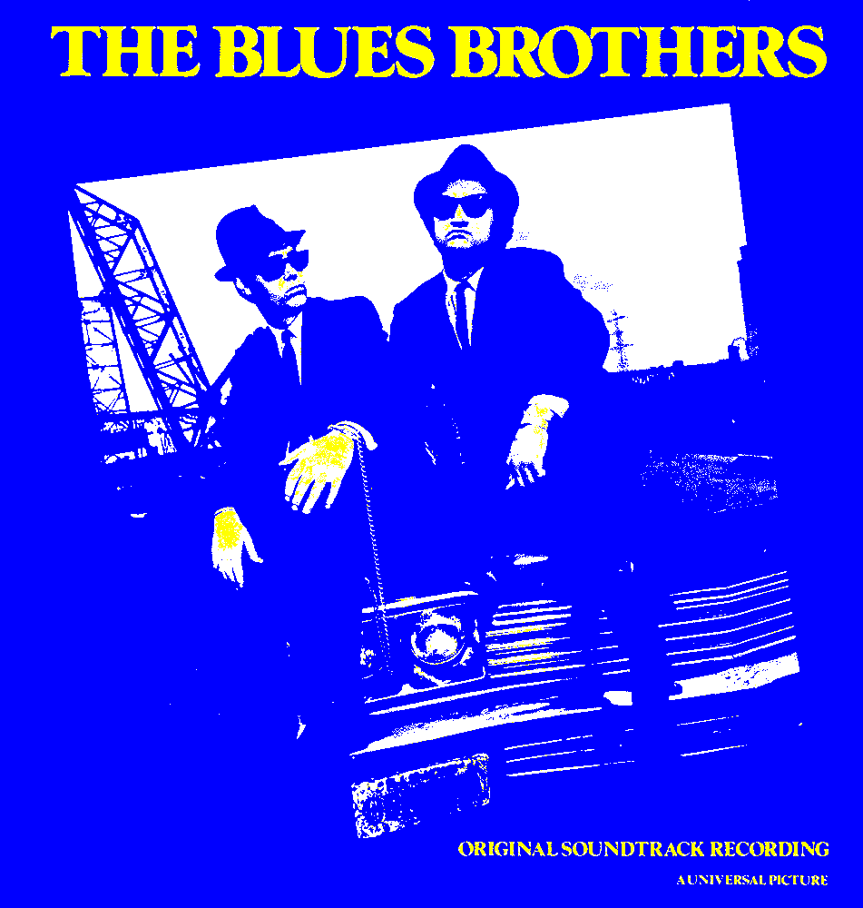

---
COMP 110 - Lab Session 8
---

# Overview
In this lab session you will read and write code that does image manipulation, which
you've read about in Chapter 6, and which you've also seen and discussed in class.
Images are 2-dimensional things, and manipulating the pixels of an image requires 
nested loops in your programs.  So this is the primary new concept you are learning about in this
chapter - using nested loops to iterate over a 2-dimensional collection of objects 
(in this case, the pixels of an image).  

You are also getting additional practice on topics that you've previously learned: 

1. Writing nested loops will help your understanding of "regular" (non-nested) loops; 
1. The loops you write to manipulate images requires that you use explicit index varaibles 
   to control the loops.
1. Several classes (defined in the cImage module) are used to work with images, so you will
   get more practice working with objects and calling class methods on those objects.

# Reminders
For this lab, you should work with your programming partner, 
so please sit next to them (moving if necessary).

Note that throughout this lab, you will see questions (Q1, Q2, ...) that you
will need to answer.  You and your partner should each create a Word document
 in which you
answer the questions.  At the top of this document include both of your names (or just your name
if your partner is not present).  Call the document comp110Lab8.
Create this document now, put your names at the top, and add answers to the
questions as you encounter them during the lab.

Before you leave at the end of the lab, BOTH of you (you and your peer
programming partner) upload to Blackboard your Word file containing the
answers to the questions. To do this, choose the Labs tab, and then Lab8.
Click on Browse My Computer under Attach File and upload your
comp110Lab8 file.  Do not upload any of your python files.  

# Initial Setup


1. Open the Command Palette in VS Code and use the "Git: Clone" command.

1. When prompted, enter the following for the repository URL: 

    https://github.com/comp110-sp19/PSA6.git

1. When prompted, choose an appropriate location.

1. Click the "Open Repository" button in the pop-up.
   In this repository you will see many files.

1. Locate the comp110_lab08.py file, and open it in the editor window.

1. In the Terminal window, make sure that you are in the right directory


1. To confirm that everything is working correctly, open up a python REPL now, using the `python3` or `python` command in your VS Code terminal.

1. Once in the REPL, enter the following import statements.
If you get an error, please get the instructor's attention.

	```python
	import cImage
    from comp110_lab08 import *
	```

# Practice Problems

The following problems will give you practice with image manipulation.


## Problem 1:  Review the code that resizes an image.

In Section 6.5.2, you studied a function named `double` that takes as its parameter an image
(an object of type `FileImage` or `EmptyImage`), and returns a new image that is a copy
of the parameter image, but is double the size.  This function is at the top of 
`comp110_lab08.py`.  Just beneath it is the function `resize`, which calls `double`.  `resize` makes it 
easier to test `double` by handling the creation and drawing of the image to be doubled, the calling
of `double`, the drawing of the doubled image, and finally exiting the program by having the user
click in the image window.  Review the code in both `double` and `resize`.

Try running the `resize` function in the REPL.  Pass in the image file `green-bird.gif`, which is in the repository.

**Q1:** Does the `double` function double the area of the image, or does it double the width and height?

**Q2:** Chapter 6 of the text shows two versions of `double`, one in Section 6.5.1, and one in Section 6.5.2.  
(The second version, the one from 6.5.2, is the one you are studying here.)  Does this version of `double`
iterate over the pixels of the new image (the image to be returned), or the pixels of the old image (the parameter
image)?

**Q3:** Suppose that a pixel in the new image is at row 5 and column 7, what is the row and column 
of the pixel from the old image that is copied into this pixel?

**Q4:** What is the type of `newimage` in the `double` function?

**Q5:** Suppose you have an `ImageWin` variable named `w`, and a `FileImage` variable named `im`.  Write a line
of code that displays `im` in `w`.

**Q6:** In the `resize` function, Explain what the line of code
```python
double_image = double(old_image)
```
is doing.

## Problem 2:  Write a function that halves the size of an image.

Write a function called `halve` that takes as parameter an image, and returns 
an image that is half the size of the parameter image.  The header for the function
is already in comp110_lab08.py.  As you probably would
guess, this function will have much in common with the `double` function.  So start
by copying `double` in comp110_lab08.py, and renaming it `halve`.
Then, think about what has to be changed in the function to make it work correctly.
Make these changes in the function.

**Q7:** What changes did you make?

**Q8:** Did you need to write code to specially handle the case where the width or height 
of the old image is odd?  Why or why not?

Edit `resize` so that it also calls the `halve` function that you just wrote.  The parameter should
be the same `oldimage` image that is the parameter to `double`.  Then, display the returned half-sized image in
its own window, in the same way that the original image and the doubled image are displayed in their
own window.

## Problem 3:  Write a function that intensifies colors in an image.

Here is the cover from the soundtrack of the best movie ever made:



We are going to intensify the colors to make a more interesting image, something like this:



The method for intensifying the image is:  iterate over all pixels , and for each pixel, test the color and intensify the color if it meets certain criteria.

You will modify a function called `intensify_pixel` that takes as a parameter an pixel, and returns a new
pixel that is a copy of the parameter image, except that certain colors have been intensified.  

**Q9:** Which color is turned to white by the code? Edit the code so that this color will be used now. 

**Q10:** Answer the question in the comment below:

``` python
max_color_distance = 255 # Why do I use 255 to create the distance threshold for testing?
```

Once you've written the function, test it by running the `intensify_image` function that is already 
in comp110_lab08.

# Submission
Before leaving lab, you should submit your answers to all the lab questions.
See the instructions at the top of this lab on where/how to submit your document.

Don't worry if you didn't get fully done with the lab: submit whatever answers
you have and work on finishing up the lab later.

# PSA Work Time / Q&A
For the rest of this lab period, you should work on the  PSA with your
partner.
